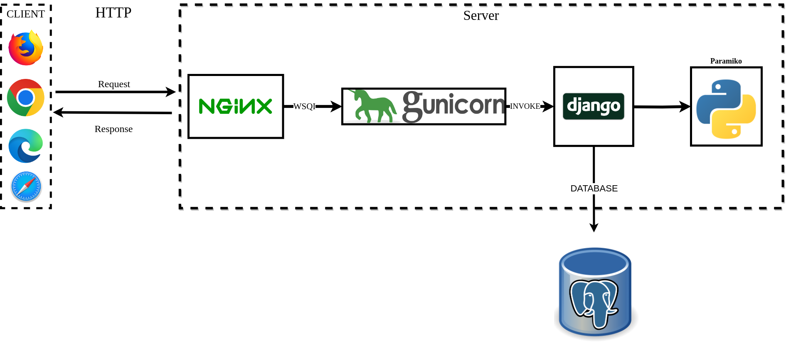
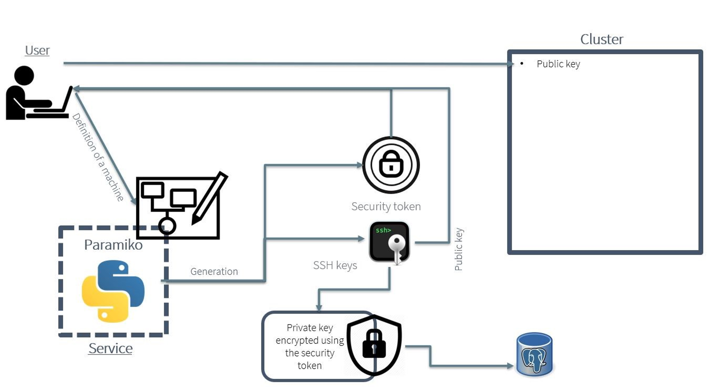
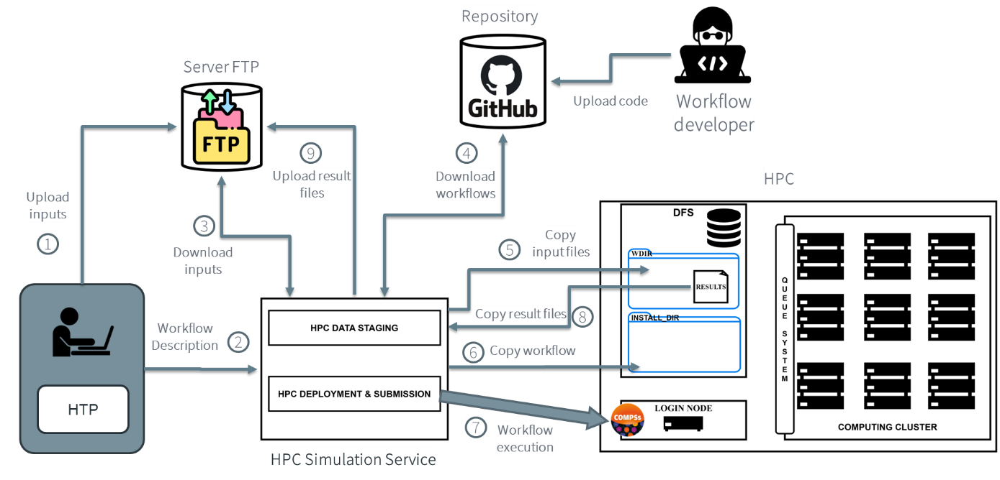

================
Simulation Service for HPC Workflow Executions
================

The HPC Simulation service aims to facilitate the management of workflow executions in HPC environments. It includes a web service and an API, enabling users and other CAELESTIS ISE components to automate workflow execution in HPC sites. The service can be utilized in standalone mode via the web GUI or in conjunction with other CAELESTIS components through the REST API.

----------
HPC Simulation Service Implementation
----------

The service is implemented using Django, Nginx, PostgreSQL, Gunicorn, and Paramiko, as depicted in the figure below. Django, a high-level Python web framework, simplifies web application development with robust tools and libraries. Gunicorn, a Python WSGI HTTP server, serves Django applications by converting HTTP requests into Django's Python code. Nginx, a high-performance web and reverse proxy server, acts as an intermediary between external clients and Gunicorn. PostgreSQL persistently stores the service status, ensuring recovery of pending operations in case of service failure. Paramiko, a Python library for SSH and SFTP operations, facilitates secure interactions with remote servers, essential for executing scripts and commands at the HPC site.

----------
HPC Simulation Service Functionality
----------

The HPC Simulation Service automates data transfers and workflow execution, requiring user authorization through their HPC site account. This process is detailed in the figure below and involves:

1. **User Registration**
   - Users sign up by providing necessary details.

2. **Machine Definition and SSH Key Creation**
   - *Post-Registration Actions*:
     Users add or define new machines to be managed by the service.
   - *SSH Key Generation*:
     The service generates SSH key pairs and a unique security token for each machine.
   - *Key and Token Distribution*:
     The public key and token are sent back to the user.

3. **Private Key Storage**
   - *Key Encryption*:
     The private key is encrypted using the security token before storage.
   - *Secure Storage*:
     The encrypted key is stored securely in the service's database.
   - *Security Assurance*:
     Ensures the private key can't be used without the corresponding security token, even if the database is accessed unauthorizedly.

4. **Public Key Authorization in the HPC**
   - Users place the received public key in the “authorized_keys” file on their machine.

Once the SSH key authorization is set up, users can manage workflow execution by providing the security token when accessing the HPC Simulation service, as depicted in the figure below. The token is used for secure connection to the HPC site and for decrypting the stored private key.

----------
Workflow Execution in HPC
----------

The HPC Simulation Service automates various phases of workflow execution in HPC sites, as shown in the figure below. The workflows can be submitted and monitored via a web interface or REST API. The execution steps include:

1. **Upload Inputs**
   - Preparation of the execution environment by uploading input files to the FTP server.

2. **Submit Workflow Description**
   - Submission of the workflow description file to the service.
   - The execution status is displayed on the web interface or retrieved via the REST API.

3. **Download Inputs**
   - Retrieval of user's input files from the FTP server.

4. **Download Workflow Code**
   - Fetching of necessary workflow code from a GitHub repository.

5. **Data Staging - Copy Input Files**
   - Copying of input files for simulations into the distributed file system (DFS).

6. **Data Staging - Copy Workflows**
   - Transfer of downloaded workflow code into the DFS.

7. **Workflow Execution**
   - Execution of specified workflows using the COMPSs workflow manager.

8. **Copy Result Files**
   - Retrieval of execution results from the DFS post-completion.

9. **Upload Result Files**
   - Permanent storage of result files on the FTP server.

This service is designed to streamline the implementation and execution of dynamic workflows, allowing for modular integration across various workflow phases.

