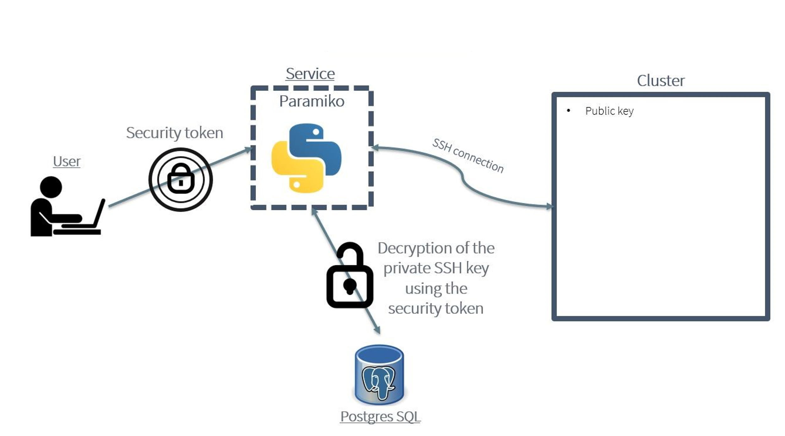

================
Simulation Service for HPC Workflow Executions
================

The HPC Simulation service aims at facilitating the management of the execution of workflows in the HPC environments. It consists of a web service and an API which allow users and other CAELESTIS ISE component to automate the execution of workflows in the HPC sites. This service can be used by users in standalone mode interacting with the web GUI or used together with other CAELESTIS components interacting through the REST API.  
|
|
|
----------
 HPC Simulation Service Implementation
----------
The HPC Simulation service has been implemented using Django, Nginx, PostgreSQL, Gunicorn and Paramiko as depicted in the figure below.  Django is a high-level Python web framework that simplifies the development of web applications by providing a robust set of tools and libraries for building dynamic web services.  Gunicorn is a Python WSGI (Web Server Gateway Interface) HTTP server. It is responsible to serve Django applications by converting the HTTP request to the Django's Python code.  Nginx is a high-performance web server and reverse proxy server. In the context of serving Django applications, Nginx is typically used as a reverse proxy. Nginx acts as an intermediary between external clients and Gunicorn. The status of the service is persistently stored in the PostgreSQL, so in case of a failure in the service happens, all the pending operations can be safely recovered. Finally, Paramiko is a Python library that offers an interface for handling SSH (Secure Shell) and SFTP (Secure FTP) operations. It facilitates secure interactions with remote servers, enabling tasks such as command execution and file transfers across secure connections. The choice of Paramiko for SSH connections is driven by its capacity to programmatically establish and oversee SSH sessions, simplifying the automation of tasks, remote command execution, and secure file transfers between systems. In the present implementation, Paramiko takes on the role of executing scripts and commands by interfacing with the HPC site.

.. image:: ./images/service_arch.png
    :align: center
    :width: 500px
    
----------
 HPC Simulation Service Implementation
----------

One of the main functionalities of the HPC Simulation Service is the automation of the data transfers and execution of the workflow. To enable it, users must authorize the HPC Simulation Service to perform these actions using their HPC site account. This process is depicted in Figure 12 and outlined as follows:

The HPC Simulation Service automates the data transfers and execution of the workflow. For this functionality to be enabled, users are required to authorize the service using their HPC site account. This authorization process is detailed in Figure 12 and involves the following steps:

1. **User Registration**
   - Users sign up for the service by providing the necessary details.

2. **Machine Definition and SSH Key Creation**
   - *Post-Registration Actions*:
     After registration, users can add or define a new machine to be managed by the service.
   - *SSH Key Generation*:
     The service generates a pair of SSH keys for the machine (a public key and a private key) along with a unique security token.
   - *Key and Token Distribution*:
     The public key and the token are sent back to the user.

3. **Private Key Storage**
   - *Key Encryption*:
     Before storing the private key in its database, the service encrypts it using the security token.
   - *Secure Storage*:
     The encrypted private key is securely stored in the service's database.
   - *Security Assurance*:
     This ensures that even if the database is accessed by unauthorized individuals, the private key cannot be used without the corresponding security token.

4. **Public Key Authorization in the HPC**
   - The user is responsible for placing the received public key in the “authorized_keys” file on the defined machine.
   - This public key serves as an identifier, allowing connections only from those with the corresponding private key.

.. image:: ./images/key.png
    :align: center
    :width: 500px
|
|
Once the user has setup the SSH key authorization, it can manage the execution of workflows providing the security token when accessing the HPC Simulation service. This token will be used to perform a secure connection to the HPC site as depicted in the figure below.

1. **Token-Based Service Call**
   - *Token Requirement for SSH Connection*:
     Each time the user wishes to connect to their machine via SSH using the service, they must provide the security token.
   - *Token Utility*:
     The security token is crucial for both authentication and for decrypting the stored private key.

2. **Decryption and Connection**
   - *Key Decryption*:
     Upon receiving the correct security token, the service decrypts the user's private key.
   - *Establishing SSH Connection*:
     The service uses the decrypted private key to establish an SSH connection to the user's machine.

**Dual-Layer Security Mechanism**
---------------------------------

This method incorporates a dual-layer security mechanism that provides robust protection against unauthorized access:

- Even if malicious actors compromise the service's database, they cannot misuse the stored private keys without the corresponding security tokens.
- Users maintain control over their machines as the service can access them only when provided with the correct security token.

This system establishes a comprehensive security framework, protecting user machines effectively. The combination of SSH key pairs and unique security tokens offers both convenience and enhanced security, safeguarding users from potential unauthorized access.

    
|
|
----------
Workflow Execution in HPC
----------

=========================

**Sequence of Steps in the HPC Simulation Service**
---------------------------------------------------

As shown in the figure below, the HPC Simulation Service automates various phases for executing workflows in HPC sites. The submission and monitoring of these workflows can be done via a web interface or through a REST API. The workflow execution involves the following steps:

1. **Upload Inputs**
   - Users or the HTP component prepare the execution environment by uploading input files to the FTP server.

2. **Submit Workflow Description**
   - Users, or the HTP via the REST API, submit a file describing the intended workflow to the service (as detailed in Section 2).
   - The execution status of the workflow is displayed on the web interface or can be retrieved via the REST API.

3. **Download Inputs**
   - The service retrieves the user's input files from the FTP server, as specified in the workflow description.

4. **Download Workflow Code**
   - Necessary workflow code is fetched from the GitHub repository based on the workflow descriptions.
   - The service downloads only the code for the specified workflows, excluding others.

5. **Data Staging - Copy Input Files**
   - The service copies all required input files for simulations into the distributed file system (DFS).

6. **Data Staging - Copy Workflows**
   - Workflow code is transferred into the installation directory within the DFS.

7. **Workflow Execution**
   - The specified workflows are executed by starting the COMPSs workflow manager in the HPC site.

8. **Copy Result Files**
   - Post-completion, the service retrieves the execution results from the DFS.

9. **Upload Result Files**
   - For permanent storage, the service uploads the result files to the FTP server.

This service is designed to streamline the implementation and execution of dynamic workflows. By differentiating between the overall workflow definition and the specification of individual phases, it overcomes previous static limitations. This allows for modular integration of various phases across workflows during setup, enhancing flexibility and efficiency.

    
.. image:: ./images/gen_arch.png
    :align: center
    :width: 500px

